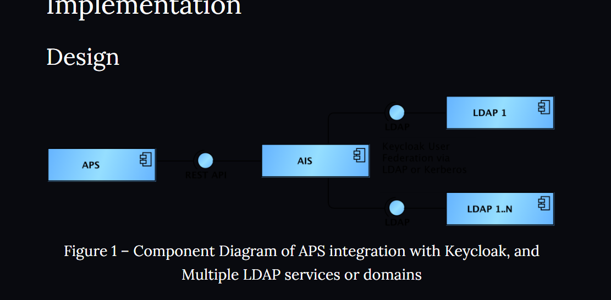
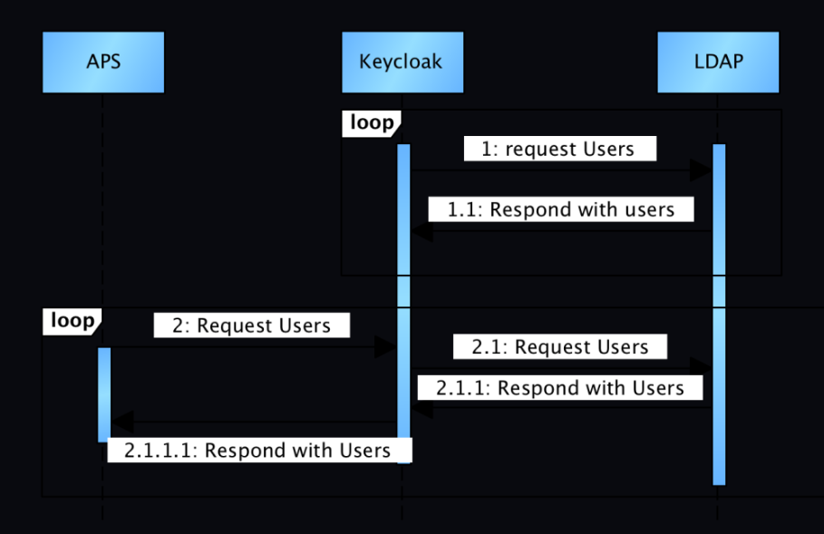
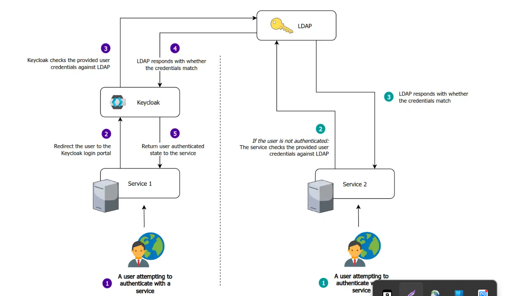

# IAM

**Table of Contents** _generated with_ [_DocToc_](https://github.com/thlorenz/doctoc)

* [Ldap and Keycloak](./#ldap--and--keycloak)

Identity

Authentication

Authorization

/workspaces/team\_lead\_docs/IAM/iam gateway.png

Password, Session, Cookie, Token, JWT, SSO, OAuth

from: https://blog.bytebytego.com/p/password-session-cookie-token-jwt?utm\_source=post-email-title\&publication\_id=817132\&post\_id=112781858\&isFreemail=true\&utm\_medium=email

### Ldap and Keycloak

https://swazzy.com/2018/08/27/user-synchronization-in-aps-from-keycloak/

https://joeeey.com/blog/selfhosting-sso-ldap-part-3/
